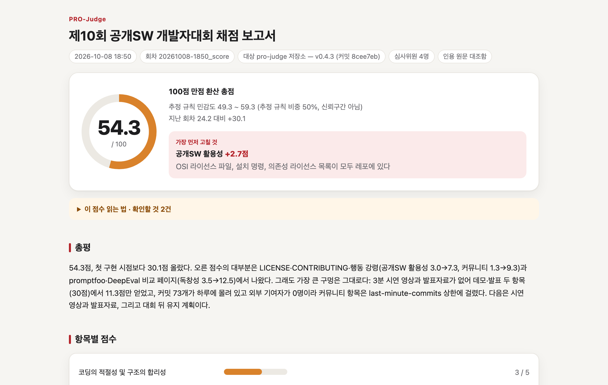

# pro-judge

**대회에 내기 전에, 그 대회 심사위원에게 먼저 채점받는다.**

공고와 심사기준을 주면 에이전트가 그 대회의 심사위원이 된다. 내 발표자료·레포·배포 서비스를 채점하고,
**어디를 고치면 몇 점이 오르는지** 순서대로 알려 준다. Claude Code·Codex·Cursor에서 쓰는 Agent Skills다.

**문서 사이트 → https://cassiiopeia.github.io/pro-judge/**

<p align="center">
  
</p>

<p align="center"><sub>이 레포를 「공개SW 개발자대회」 심사기준으로 채점한 실제 보고서 ·
<a href="https://cassiiopeia.github.io/pro-judge/guide/reading-report">전체 보기</a></sub></p>

## 설치

```bash
python3 -m pip install pyyaml
npx skills add Cassiiopeia/pro-judge
```

Claude Code 플러그인으로 설치하려면 `/plugin marketplace add Cassiiopeia/pro-judge` 후 `/plugin install pro-judge@pro-judge`.
두 방식의 차이와 PDF 도구 선택은 [시작하기](https://cassiiopeia.github.io/pro-judge/guide/getting-started)에 있다.

## 쓰기

명령어 없이 말로 시킨다.

| 하고 싶은 것 | 이렇게 말한다 |
| --- | --- |
| 대회 등록 | `이 대회 나갈 거야 <공고 URL·PDF>` |
| 아이디어 비교 | `아이디어 3개 중 뭐가 점수 잘 나와?` |
| 자료 채점 | `발표자료 몇 점이야? ./slides.pdf` · `이 레포 채점해줘` |
| 질의응답 연습 | `질의응답 연습하자` |

채점 전에 자료를 모으고, 빠진 근거는 웹에서 찾거나 하나씩 묻는다. 결과는 `docs/pro-judge/<대회>/`에 쌓이고 기본으로 git에서 빠진다.

## 무엇이 다른가

- **점수표부터 만든다** — 한 줄 기준도 판정 질문·0/5/10점 기준 문장·상한 규칙으로 펼친다
- **심사위원마다 따로 채점** — 대회 구성을 따른 페르소나가 서로의 점수를 보지 않는다
- **규칙은 코드로 강제** — 7점 이상은 원문 인용이 필요하고, 자료에 없는 인용은 지운다
- **못 본 것도 남긴다** — 무엇을 봤고 무엇을 못 봤는지 근거 장부로 보고서에 드러난다

[비슷한 도구(promptfoo·DeepEval)와의 비교](https://cassiiopeia.github.io/pro-judge/guide/compare)

## 검증

실제 수상 결과로 두 번 맞혀 봤다. 자세한 내용은 [검증 결과](https://cassiiopeia.github.io/pro-judge/validation).

| 대회 | 결과 |
| --- | --- |
| 2025 오픈소스 개발자대회 (저장소) | 수상팀이 미수상팀보다 높게 나온 쌍 **29 / 36** (한 줄 프롬프트 26 / 36) |
| 2025 장애인 분야 해커톤 (문서) | 분야별 장관상 2팀 중 **1팀**만 1위 — 발표·시연 인상은 보지 못한다 |

수상 여부를 맞히는 도구가 아니라, **자료에서 무엇이 빠졌는지 짚는 진단 도구**다.

## 기여

[CONTRIBUTING.md](CONTRIBUTING.md) · 보안 문제는 [비공개 신고](https://github.com/Cassiiopeia/pro-judge/security/advisories/new) · 라이선스 [Apache-2.0](LICENSE)

---

<!-- AUTO-VERSION-SECTION: DO NOT EDIT MANUALLY -->
## 최신 버전 : v0.4.0 (2026-10-08)

[전체 버전 기록 보기](CHANGELOG.md)
