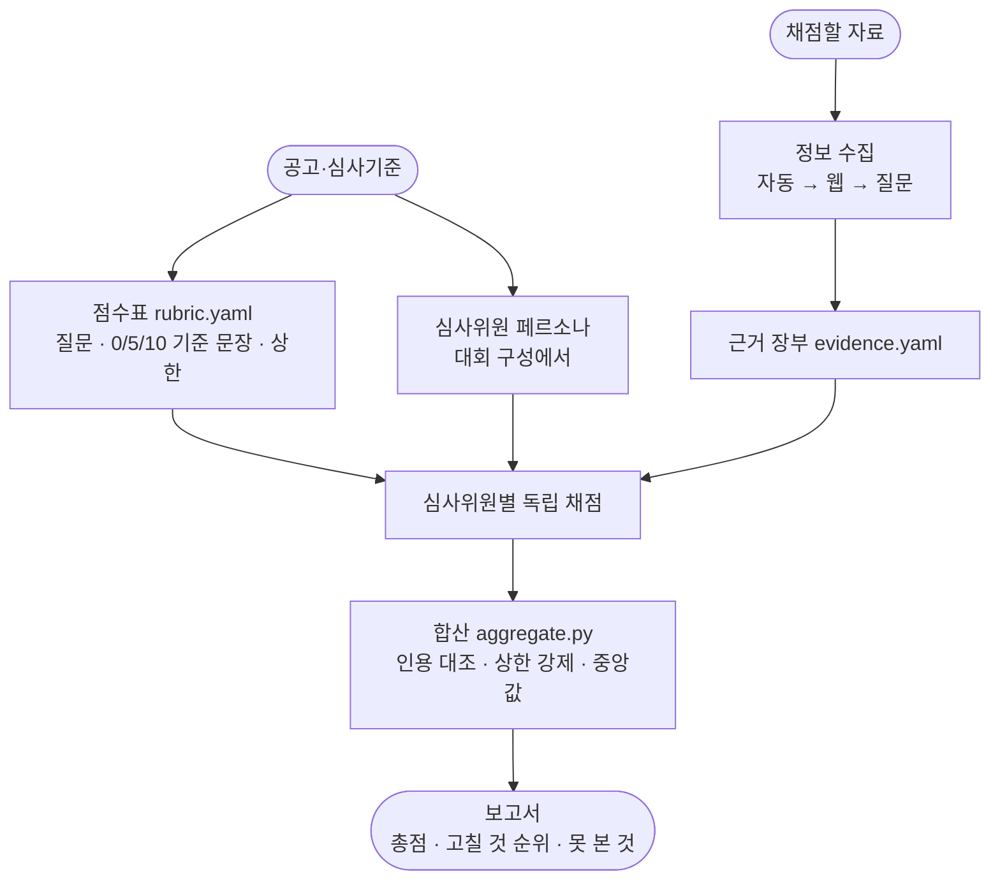

# 작동 방식

판단은 에이전트가, 숫자는 스크립트가 맡는다. 에이전트가 규칙을 어겨도 합산 단계에서 강제로 맞춰진다.

## 1. 점수표

공고의 한 줄 기준을 같은 순서로 펼친다.

1. 심사위원이 실제로 묻는 질문 2~3개로 바꾼다
2. 질문마다 "그렇다"로 인정하는 근거 종류를 정한다 — 숫자·고유명사·시연·실증·인용·관찰
3. 0점·5점·10점 기준 문장을 관찰 가능한 말로 쓴다 ("잘했다·충분하다"는 검사기가 거부한다)
4. 상한 규칙을 붙인다 — 예: 시연 근거가 없으면 4점까지

공고에 있는 것은 `official`, 에이전트가 정한 것은 `inferred`로 표시하고 이유를 단다. 보고서 부록에 모두 나온다.

## 2. 심사위원

공고의 심사위원 구성(예: 장애인 전문가 3 + 기술 전문가 2 + 시민평가단)에서 페르소나를 만든다.
각자 다른 모델로, 서로의 점수를 보지 않고 채점한다. 의견이 3점 이상 갈린 항목은 편차 경보가 뜬다.

## 3. 정보 수집

채점 전에 자료를 최대한 모은다.

| 자료 | 도구 |
| --- | --- |
| PDF·PPTX·DOCX | `extract_target.py` — 이미지 쪽은 OCR, 앱 화면·도표는 이미지로 보관 |
| 저장소 | `repo_facts.py` — 커밋·작성자·라이선스·테스트·CI. fork면 원본에 없는 팀 커밋만 센다. 코드는 실행하지 않는다 |
| URL·배포 서비스 | 에이전트가 열어 보고 읽은 것을 기록 |

점수표가 요구하는 근거 중 빠진 것(빈칸)을 계산해 웹에서 찾고, 그래도 비면 묻는다. "없다"는 답도 기록해 다시 묻지 않는다.

## 4. 합산 규칙

| 규칙 | 내용 |
| --- | --- |
| 인용 대조 | 7점 이상은 원문 인용이 필요하다. 원문에 없는 인용은 지우고, 인용이 남지 않으면 6점이 된다 |
| 상한 강제 | 신고된 상한보다 높은 점수는 상한으로 내린다. 확인 불가는 시연 실패와 같은 4점 — 데모를 숨기는 편이 유리하지 않게 |
| 중앙값 | 심사위원별 여러 회차의 중앙값, 그룹별 평균, 배점 환산 |
| 고칠 것 순위 | 각 항목을 다음 기준 문장(5점 또는 10점)까지 올렸을 때 오르는 총점 순 |
