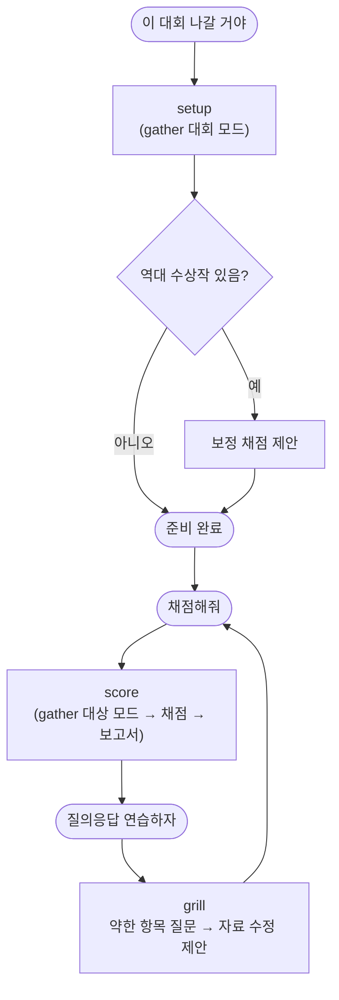

# skill 6개

사용자는 skill 이름을 몰라도 된다. 말로 요청하면 길잡이가 맞는 skill을 부르고, 필요한 skill은 알아서 먼저 부른다.

| skill | 하는 일 | 이렇게 말하면 |
| --- | --- | --- |
| `using-pro-judge` | 길잡이. 요청을 알아듣고 아래 skill을 부른다 | (자동) |
| `pro-judge-setup` | 대회 등록 — 점수표·심사위원·취지 | "이 대회 나갈 거야 <공고>" |
| `pro-judge-gather` | 정보 수집 — 자동·웹·질문, 근거 장부 | "자료 더 찾아줘", "뭐가 빠졌어" (setup·score가 먼저 부른다) |
| `pro-judge-ideas` | 아이디어 비교 — 완벽히 구현했을 때의 상한 점수 | "아이디어 중 뭐가 나아" |
| `pro-judge-score` | 자료 채점 — 독립 채점·합산·보고서 | "몇 점이야", "다시 봐줘" |
| `pro-judge-grill` | 질의응답 연습 — 약한 곳을 찌르는 질문과 판정 | "질의응답 연습하자" |

## 한 번의 흐름

